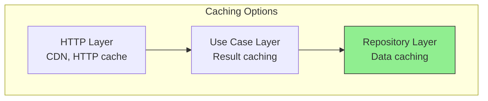
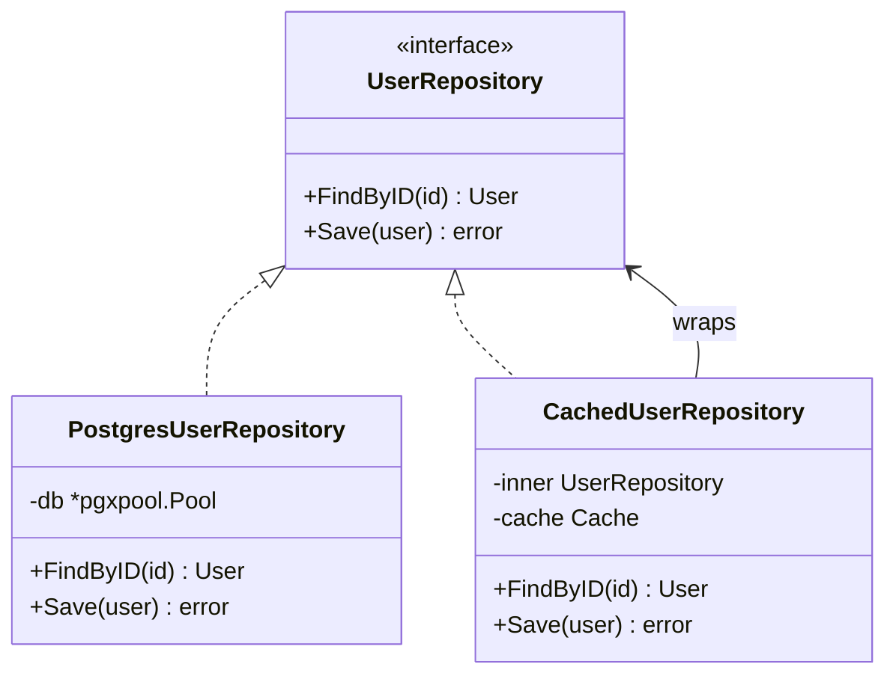

# Caching Strategies

## Sam's Scenario

BookShelf was slowing down. Every book search hit the database, and popular books were queried dozens of times per second. Sam needed caching, but he didn't want to clutter his repository code with Redis calls.

"Use the decorator pattern," Alex suggested. "Wrap your BookRepository with a CachedBookRepository. The use cases don't know they're talking to a cache - they just see the same interface. Let me show you how to add caching without touching your business logic."

## Caching Without Complexity

Caching improves performance but adds complexity. In Hexagonal Architecture, we can implement caching as a decorator without changing business logic.

## Where Does Caching Fit?



The **repository decorator** pattern is most common - cache database results.

## Cache Decorator Pattern



## Implementing a Cache Decorator

```go
// adapters/cache/cached_user_repo.go
type CachedUserRepository struct {
    inner repositories.UserRepository
    cache Cache
    ttl   time.Duration
}

func NewCachedUserRepository(inner repositories.UserRepository, cache Cache, ttl time.Duration) *CachedUserRepository {
    return &CachedUserRepository{
        inner: inner,
        cache: cache,
        ttl:   ttl,
    }
}

func (r *CachedUserRepository) FindByID(ctx context.Context, id string) (*entities.User, error) {
    key := "user:" + id

    // Try cache first
    cached, err := r.cache.Get(ctx, key)
    if err == nil {
        var user entities.User
        if json.Unmarshal(cached, &user) == nil {
            return &user, nil  // Cache hit
        }
    }

    // Cache miss - fetch from database
    user, err := r.inner.FindByID(ctx, id)
    if err != nil {
        return nil, err
    }

    // Store in cache
    if data, err := json.Marshal(user); err == nil {
        r.cache.Set(ctx, key, data, r.ttl)
    }

    return user, nil
}

func (r *CachedUserRepository) Save(ctx context.Context, user *entities.User) error {
    // Invalidate cache on write
    key := "user:" + user.ID
    r.cache.Delete(ctx, key)

    return r.inner.Save(ctx, user)
}
```

## Cache Port Interface

```go
// domain/ports/cache.go
type Cache interface {
    Get(ctx context.Context, key string) ([]byte, error)
    Set(ctx context.Context, key string, value []byte, ttl time.Duration) error
    Delete(ctx context.Context, key string) error
}
```

## Redis Cache Adapter

```go
// adapters/cache/redis/cache.go
type RedisCache struct {
    client *redis.Client
}

func (c *RedisCache) Get(ctx context.Context, key string) ([]byte, error) {
    return c.client.Get(ctx, key).Bytes()
}

func (c *RedisCache) Set(ctx context.Context, key string, value []byte, ttl time.Duration) error {
    return c.client.Set(ctx, key, value, ttl).Err()
}

func (c *RedisCache) Delete(ctx context.Context, key string) error {
    return c.client.Del(ctx, key).Err()
}
```

## Wiring Cached Repository

```go
// cmd/api/main.go
func main() {
    // Create base repository
    userRepo := postgres.NewUserRepository(db)

    // Wrap with cache (optional based on config)
    if cfg.CacheEnabled {
        redisCache := redis.NewCache(redisClient)
        userRepo = cache.NewCachedUserRepository(userRepo, redisCache, 5*time.Minute)
    }

    // Use in use cases - they don't know about caching
    userUseCase := usecases.NewUserUseCase(userRepo, emailSender, logger)
}
```

## Cache Invalidation Strategies

| Strategy | When to Use | Complexity |
|----------|-------------|------------|
| **TTL expiration** | Data can be stale briefly | Low |
| **Write-through** | Invalidate on every write | Medium |
| **Event-based** | Invalidate on domain events | High |

```go
// Event-based invalidation
func (h *CacheInvalidationHandler) Handle(ctx context.Context, e events.Event) error {
    switch event := e.(type) {
    case events.UserUpdated:
        return h.cache.Delete(ctx, "user:"+event.UserID)
    case events.UserDeleted:
        return h.cache.Delete(ctx, "user:"+event.UserID)
    }
    return nil
}
```

## Caching Best Practices

| Practice | Description |
|----------|-------------|
| **Cache at repository level** | Keeps use cases unaware of caching |
| **Use TTL** | Prevents stale data from living forever |
| **Invalidate on writes** | Keep cache consistent with DB |
| **Handle cache failures gracefully** | Fall back to database |
| **Monitor hit rates** | Track cache effectiveness |

## Sam's Performance Boost

After adding the cached repository decorator, BookShelf's performance improved dramatically. Book searches that took 50ms now took 2ms when cached. Database load dropped by 80% for read operations.

"The beautiful part," Sam told Maya, "is that my use cases have no idea there's a cache. If Redis goes down, the decorator falls back to PostgreSQL. If we want to change caching strategies, we just swap the decorator. The business logic never changes."

Maya was impressed. "So when we scale to 100,000 users, caching will keep us fast without requiring a rewrite?"

"Exactly," Sam confirmed. "Hexagonal architecture makes performance optimizations like caching purely operational concerns."
