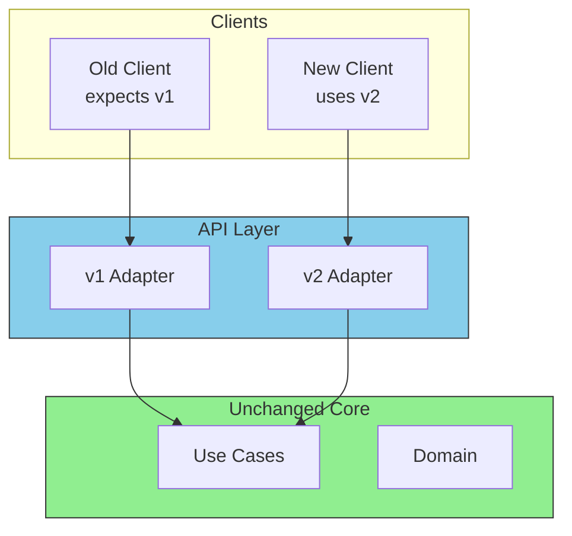
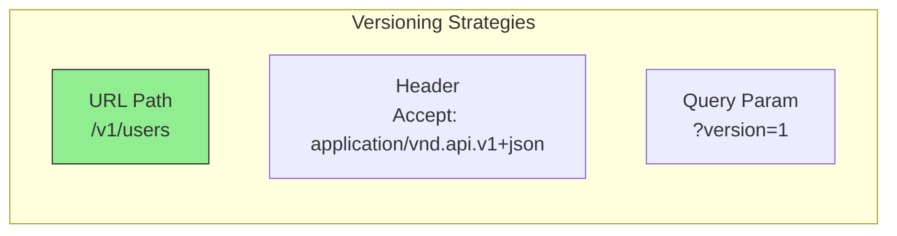

# API Versioning

APIs evolve over time. In Hexagonal Architecture, versioning happens in the driving adapters, keeping the domain stable.

## Why Versioning Matters



## Versioning Happens in Adapters

The domain and use cases don't know about API versions. Each version has its own adapter that:
- Accepts the version-specific request format
- Calls the same use cases
- Returns the version-specific response format

## Multiple Handler Versions

```go
// adapters/http/v1/user_handler.go
package v1

type UserHandler struct {
    userService ports.UserService
}

type CreateUserRequestV1 struct {
    Name  string `json:"name"`
    Email string `json:"email"`
}

type UserResponseV1 struct {
    ID    string `json:"id"`
    Name  string `json:"name"`
    Email string `json:"email"`
}

func (h *UserHandler) CreateUser(w http.ResponseWriter, r *http.Request) {
    var req CreateUserRequestV1
    json.NewDecoder(r.Body).Decode(&req)

    user, err := h.userService.CreateUser(r.Context(), ports.CreateUserInput{
        Name:  req.Name,
        Email: req.Email,
    })
    if err != nil {
        // Handle error
        return
    }

    json.NewEncoder(w).Encode(UserResponseV1{
        ID:    user.ID,
        Name:  user.Name,
        Email: user.Email,
    })
}
```

```go
// adapters/http/v2/user_handler.go
package v2

type UserHandler struct {
    userService ports.UserService
}

type CreateUserRequestV2 struct {
    FullName    string `json:"full_name"`  // Changed field name
    EmailAddr   string `json:"email_addr"` // Changed field name
    PhoneNumber string `json:"phone"`      // New field
}

type UserResponseV2 struct {
    ID          string `json:"id"`
    FullName    string `json:"full_name"`
    EmailAddr   string `json:"email_addr"`
    PhoneNumber string `json:"phone,omitempty"`
    CreatedAt   string `json:"created_at"`  // New field
}

func (h *UserHandler) CreateUser(w http.ResponseWriter, r *http.Request) {
    var req CreateUserRequestV2
    json.NewDecoder(r.Body).Decode(&req)

    // Same use case, different input mapping
    user, err := h.userService.CreateUser(r.Context(), ports.CreateUserInput{
        Name:  req.FullName,
        Email: req.EmailAddr,
        Phone: req.PhoneNumber,
    })
    if err != nil {
        // Handle error
        return
    }

    json.NewEncoder(w).Encode(UserResponseV2{
        ID:          user.ID,
        FullName:    user.Name,
        EmailAddr:   user.Email,
        PhoneNumber: user.Phone,
        CreatedAt:   user.CreatedAt.Format(time.RFC3339),
    })
}
```

## Router Configuration

```go
// cmd/api/main.go
func setupRoutes(mux *http.ServeMux, userService ports.UserService) {
    // V1 handlers
    v1Handler := v1.NewUserHandler(userService)
    mux.HandleFunc("POST /v1/users", v1Handler.CreateUser)
    mux.HandleFunc("GET /v1/users/{id}", v1Handler.GetUser)

    // V2 handlers
    v2Handler := v2.NewUserHandler(userService)
    mux.HandleFunc("POST /v2/users", v2Handler.CreateUser)
    mux.HandleFunc("GET /v2/users/{id}", v2Handler.GetUser)
}
```

## Versioning Strategies



| Strategy | Pros | Cons |
|----------|------|------|
| **URL Path** | Clear, easy to implement | Longer URLs |
| **Header** | Clean URLs | Harder to test |
| **Query Param** | Flexible | Can be forgotten |

URL path versioning is most common and recommended.

## Deprecation Strategy

```go
// Middleware to warn about deprecated versions
func DeprecationMiddleware(version string, sunset time.Time) func(http.Handler) http.Handler {
    return func(next http.Handler) http.Handler {
        return http.HandlerFunc(func(w http.ResponseWriter, r *http.Request) {
            w.Header().Set("Deprecation", "true")
            w.Header().Set("Sunset", sunset.Format(http.TimeFormat))
            w.Header().Set("Link", `</v2/users>; rel="successor-version"`)

            next.ServeHTTP(w, r)
        })
    }
}
```

## API Versioning Best Practices

| Practice | Description |
|----------|-------------|
| **Version adapters, not domain** | Domain stays stable |
| **Use URL path versioning** | Clear and widely understood |
| **Deprecate gracefully** | Give clients time to migrate |
| **Document changes** | Provide migration guides |
| **Support 2-3 versions max** | Limit maintenance burden |
