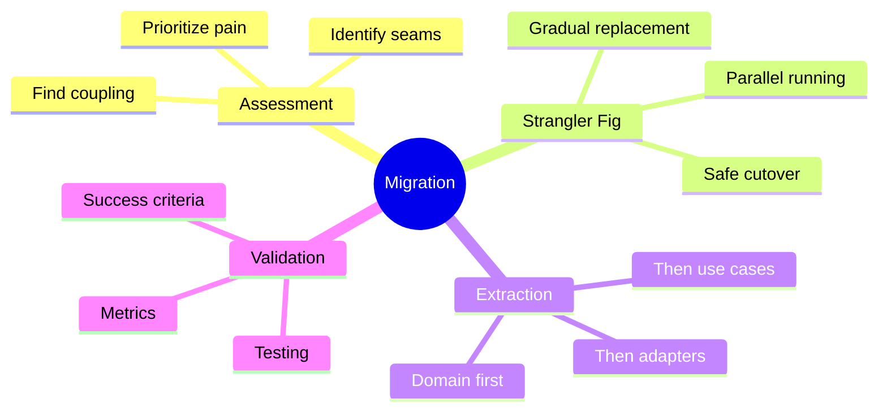
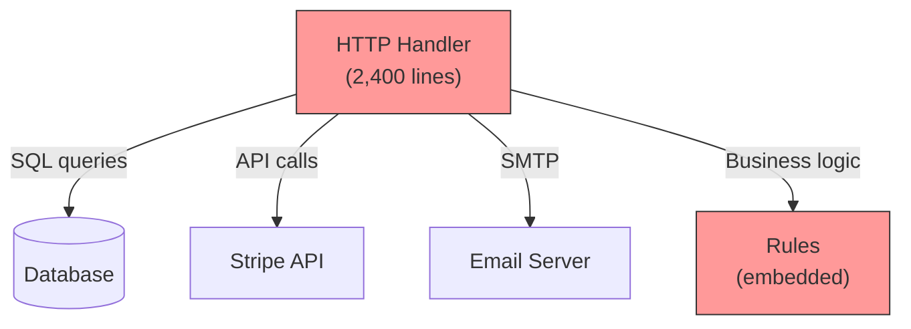
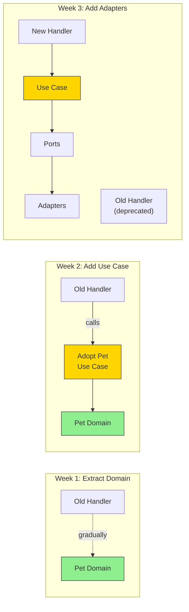

# Migration Strategies

How do you migrate an existing application to Hexagonal Architecture? This chapter covers practical strategies for gradual, low-risk migration.

## What You'll Learn in This Chapter



## Chapter Overview

### 9.1 Assessing Your Current Architecture
Learn to identify coupling, pain points, and the best places to start.

### 9.2 The Strangler Fig Pattern
Gradually replace parts of your system without a risky "big bang" rewrite.

### 9.3 Extracting the Domain
How to pull business logic out of handlers and into a clean domain layer.

### 9.4 Introducing Ports and Adapters
Create interfaces incrementally as you extract functionality.

### 9.5 Validating the Migration
Measure success and ensure you haven't broken anything.

## The Golden Rule of Migration

> **Never stop shipping.** A migration that blocks feature development is a migration that will be cancelled.

Migrate incrementally, proving value at each step.

Let's begin!

## Sam's Challenge: Helping a Friend

Sam's friend Riley called in panic. "My startup's codebase is a nightmare. Every change breaks something. I heard you rebuilt BookShelf with some 'hexagonal' thing? Can you help?"

Sam visited Riley's office and saw code that looked eerily familiar - like BookShelf before the refactoring.

**Riley's app: PetAdopt** (pet adoption platform)

```go
// main.go (2,400 lines)
package main

import (
    "database/sql"
    "net/http"
    "github.com/stripe/stripe-go"
)

var db *sql.DB

func handleAdoptPet(w http.ResponseWriter, r *http.Request) {
    petID := r.FormValue("pet_id")
    userID := r.FormValue("user_id")

    // Check if pet exists (SQL in handler!)
    row := db.QueryRow("SELECT status FROM pets WHERE id = ?", petID)
    var status string
    row.Scan(&status)

    if status != "available" {
        http.Error(w, "Not available", 400)
        return
    }

    // Business rule (scattered!)
    row = db.QueryRow("SELECT COUNT(*) FROM adoptions WHERE user_id = ? AND status = 'pending'", userID)
    var count int
    row.Scan(&count)
    if count >= 3 {
        http.Error(w, "Too many pending", 400)
        return
    }

    // Stripe payment (infrastructure in handler!)
    charge, _ := stripe.Charges.New(&stripe.ChargeParams{
        Amount:   50000,
        Currency: "usd",
        Source:   r.FormValue("token"),
    })

    // Update database
    db.Exec("UPDATE pets SET status = 'adopted' WHERE id = ?", petID)
    db.Exec("INSERT INTO adoptions (pet_id, user_id, charge_id) VALUES (?, ?, ?)",
        petID, userID, charge.ID)

    // Email (SMTP directly in handler!)
    sendEmail(userEmail, "Adoption Confirmed")

    w.Write([]byte("Success"))
}
```

Sam winced. "This is exactly where I started. Let me show you how to migrate this gradually."

Riley looked worried. "I can't stop shipping features. We have investors breathing down our necks."

"That's the beauty of the Strangler Fig pattern," Sam explained. "We migrate piece by piece without stopping development."

## Step 1: Assess the Current Architecture

Sam and Riley mapped out PetAdopt's coupling:



"Everything is coupled to everything," Riley moaned.

Sam created a migration assessment:

| Area | Pain Level | Business Impact | Migration Priority |
|------|------------|-----------------|-------------------|
| Pet adoption logic | 🔥🔥🔥 Critical | Core business | 1 - Start here |
| Payment processing | 🔥🔥 High | Revenue critical | 2 |
| Email notifications | 🔥 Medium | Can fail silently | 3 |
| Search/filtering | 🔥 Medium | Read-only | 4 |

"We start with the most painful, highest-value area: pet adoption," Sam decided.

## Step 2: The Strangler Fig Pattern

Sam drew the strategy:



"Each week, we ship working code. No big bang rewrite," Sam emphasized.

## Week 1: Extract the Domain

### Before (Logic in Handler)

```go
// main.go
func handleAdoptPet(w http.ResponseWriter, r *http.Request) {
    // ... SQL query to get status ...

    if status != "available" {  // ← Business rule buried in handler
        http.Error(w, "Not available", 400)
        return
    }

    // ... more embedded logic ...
}
```

### After (Domain Entity Created)

Sam helped Riley create the first domain entity:

```go
// domain/pet/pet.go
package pet

import "errors"

type Status string

const (
    StatusAvailable Status = "available"
    StatusPending   Status = "pending"
    StatusAdopted   Status = "adopted"
)

type Pet struct {
    id      ID
    name    string
    species string
    age     int
    status  Status
}

func NewPet(name, species string, age int) (*Pet, error) {
    if name == "" {
        return nil, errors.New("name is required")
    }
    if age < 0 {
        return nil, errors.New("age must be positive")
    }

    return &Pet{
        id:      NewID(),
        name:    name,
        species: species,
        age:     age,
        status:  StatusAvailable,
    }, nil
}

// Business rule now lives in the domain!
func (p *Pet) Adopt() error {
    if p.status != StatusAvailable {
        return errors.New("pet is not available for adoption")
    }

    p.status = StatusAdopted
    return nil
}

func (p *Pet) IsAvailable() bool {
    return p.status == StatusAvailable
}
```

### Gradual Integration (Still using old handler)

```go
// main.go (temporarily uses both old and new code)
func handleAdoptPet(w http.ResponseWriter, r *http.Request) {
    petID := r.FormValue("pet_id")

    // OLD: Fetch from database
    row := db.QueryRow("SELECT id, name, species, age, status FROM pets WHERE id = ?", petID)
    var id, name, species, status string
    var age int
    row.Scan(&id, &name, &species, &age, &status)

    // NEW: Reconstruct domain entity
    p := pet.Reconstruct(
        pet.IDFromString(id),
        name,
        species,
        age,
        pet.StatusFromString(status),
    )

    // NEW: Use domain logic instead of inline check
    if err := p.Adopt(); err != nil {
        http.Error(w, err.Error(), 400)
        return
    }

    // OLD: Still saving directly to DB
    db.Exec("UPDATE pets SET status = ? WHERE id = ?", p.Status(), petID)

    w.Write([]byte("Success"))
}
```

"See? We're using the domain entity, but the handler still works," Sam pointed out.

**Shipped to production:** ✓ No breaking changes, business logic now testable.

## Week 2: Extract the Use Case

### Create the Use Case

```go
// application/usecases/adopt_pet.go
package usecases

type AdoptPetUseCase struct {
    petRepo     PetRepository  // Interface (not implementation yet!)
    paymentSvc  PaymentService
    notifier    Notifier
}

type PetRepository interface {
    FindByID(id pet.ID) (*pet.Pet, error)
    Save(p *pet.Pet) error
}

type PaymentService interface {
    ChargeAdoptionFee(userID string, amount int) (string, error)
}

type Notifier interface {
    SendAdoptionConfirmation(userEmail string, p *pet.Pet) error
}

func (uc *AdoptPetUseCase) Execute(userID string, petID pet.ID) error {
    // Fetch pet
    p, err := uc.petRepo.FindByID(petID)
    if err != nil {
        return err
    }

    // Domain logic
    if err := p.Adopt(); err != nil {
        return err
    }

    // Charge payment
    chargeID, err := uc.paymentSvc.ChargeAdoptionFee(userID, 50000)
    if err != nil {
        return err
    }

    // Save pet
    if err := uc.petRepo.Save(p); err != nil {
        return err
    }

    // Notify (async, can fail silently)
    go uc.notifier.SendAdoptionConfirmation(userEmail, p)

    return nil
}
```

### Temporary Adapter (Wraps Old Code)

Sam created temporary adapters that use the existing database code:

```go
// adapters/legacy/pet_repository.go
package legacy

import (
    "database/sql"
    "petadopt/domain/pet"
)

type LegacyPetRepository struct {
    db *sql.DB  // Uses existing database connection
}

func (r *LegacyPetRepository) FindByID(id pet.ID) (*pet.Pet, error) {
    row := r.db.QueryRow("SELECT id, name, species, age, status FROM pets WHERE id = ?", id.String())

    var idStr, name, species, statusStr string
    var age int
    err := row.Scan(&idStr, &name, &species, &age, &statusStr)
    if err != nil {
        return nil, err
    }

    return pet.Reconstruct(
        pet.IDFromString(idStr),
        name,
        species,
        age,
        pet.StatusFromString(statusStr),
    ), nil
}

func (r *LegacyPetRepository) Save(p *pet.Pet) error {
    _, err := r.db.Exec("UPDATE pets SET status = ? WHERE id = ?",
        p.Status(), p.ID().String())
    return err
}
```

### Update Handler (Calls Use Case)

```go
// main.go
var adoptPetUseCase *usecases.AdoptPetUseCase

func init() {
    // Wire up use case with legacy adapters
    petRepo := legacy.NewLegacyPetRepository(db)
    paymentSvc := legacy.NewLegacyStripeService()
    notifier := legacy.NewLegacySMTPNotifier()

    adoptPetUseCase = &usecases.AdoptPetUseCase{
        petRepo:    petRepo,
        paymentSvc: paymentSvc,
        notifier:   notifier,
    }
}

func handleAdoptPet(w http.ResponseWriter, r *http.Request) {
    petID := pet.IDFromString(r.FormValue("pet_id"))
    userID := r.FormValue("user_id")

    // Now just calls use case!
    if err := adoptPetUseCase.Execute(userID, petID); err != nil {
        http.Error(w, err.Error(), 400)
        return
    }

    w.Write([]byte("Success"))
}
```

"The handler is now tiny. All logic is in the use case," Sam noted.

**Shipped to production:** ✓ Handler simplified, use case is testable.

## Week 3: Replace Adapters

### Clean Postgres Adapter

Now Sam helped replace the legacy adapters with clean ones:

```go
// adapters/postgres/pet_repository.go
package postgres

import (
    "database/sql"
    "petadopt/domain/pet"
    "petadopt/application/ports"
)

type PetRepository struct {
    db *sql.DB
}

func NewPetRepository(db *sql.DB) ports.PetRepository {
    return &PetRepository{db: db}
}

func (r *PetRepository) FindByID(id pet.ID) (*pet.Pet, error) {
    // Clean implementation (same as legacy, but properly structured)
    // ...
}
```

### Clean Stripe Adapter

```go
// adapters/stripe/payment_service.go
package stripe

import (
    "github.com/stripe/stripe-go/v76"
    "petadopt/application/ports"
)

type PaymentService struct {
    apiKey string
}

func NewPaymentService(apiKey string) ports.PaymentService {
    stripe.Key = apiKey
    return &PaymentService{apiKey: apiKey}
}

func (s *PaymentService) ChargeAdoptionFee(userID string, amount int) (string, error) {
    params := &stripe.ChargeParams{
        Amount:   stripe.Int64(int64(amount)),
        Currency: stripe.String("usd"),
    }

    charge, err := stripe.Charges.New(params)
    if err != nil {
        return "", err
    }

    return charge.ID, nil
}
```

### Clean HTTP Handler

```go
// adapters/http/pet_handler.go
package http

type PetHandler struct {
    adoptPet *usecases.AdoptPetUseCase
}

func (h *PetHandler) AdoptPet(w http.ResponseWriter, r *http.Request) {
    var req struct {
        UserID string `json:"user_id"`
        PetID  string `json:"pet_id"`
    }

    if err := json.NewDecoder(r.Body).Decode(&req); err != nil {
        http.Error(w, "invalid request", http.StatusBadRequest)
        return
    }

    petID := pet.IDFromString(req.PetID)

    if err := h.adoptPet.Execute(req.UserID, petID); err != nil {
        http.Error(w, err.Error(), http.StatusBadRequest)
        return
    }

    w.WriteHeader(http.StatusCreated)
    json.NewEncoder(w).Encode(map[string]string{
        "message": "Pet adopted successfully",
    })
}
```

### Final Wiring

```go
// cmd/api/main.go
package main

func main() {
    // Configuration
    db := setupDatabase()
    stripeKey := os.Getenv("STRIPE_API_KEY")

    // Clean adapters
    petRepo := postgres.NewPetRepository(db)
    paymentSvc := stripe.NewPaymentService(stripeKey)
    notifier := email.NewSMTPNotifier(...)

    // Use case
    adoptPet := usecases.NewAdoptPetUseCase(petRepo, paymentSvc, notifier)

    // HTTP handler
    petHandler := httphandler.NewPetHandler(adoptPet)

    // Routes
    mux := http.NewServeMux()
    mux.HandleFunc("POST /api/pets/adopt", petHandler.AdoptPet)

    log.Fatal(http.ListenAndServe(":8080", mux))
}
```

**Shipped to production:** ✓ Full hexagonal architecture, legacy code removed.

## Week 4: Add Tests

Now that the architecture was clean, testing was easy:

```go
// application/usecases/adopt_pet_test.go
func TestAdoptPet_Success(t *testing.T) {
    // Mock repositories (easy now!)
    petRepo := &mockPetRepository{
        pets: map[pet.ID]*pet.Pet{
            pet1.ID(): pet1,
        },
    }
    paymentSvc := &mockPaymentService{}
    notifier := &mockNotifier{}

    useCase := usecases.NewAdoptPetUseCase(petRepo, paymentSvc, notifier)

    err := useCase.Execute("user-123", pet1.ID())

    if err != nil {
        t.Fatalf("expected success, got %v", err)
    }

    // Verify pet status changed
    saved := petRepo.pets[pet1.ID()]
    if saved.Status() != pet.StatusAdopted {
        t.Error("expected pet to be adopted")
    }

    // Verify payment charged
    if paymentSvc.chargeCount != 1 {
        t.Error("expected payment to be charged")
    }
}
```

Riley ran the tests:
```
go test ./...
PASS
coverage: 81.3% of statements
```

"We went from 0% test coverage to 81% in four weeks!" Riley exclaimed.

## Migration Progress Tracking

Sam created a migration dashboard for Riley:

| Component | Status | Test Coverage | LOC (before → after) |
|-----------|--------|---------------|----------------------|
| Pet adoption | ✅ Complete | 89% | 450 → 320 |
| User management | 🟡 In progress | 67% | 380 → 280 |
| Search | 🔵 Planned | 0% | 290 → ? |
| Payments | ✅ Complete | 85% | 220 → 180 |
| Email | ✅ Complete | 78% | 150 → 120 |

## The Results

After 8 weeks of gradual migration:

**Before:**
- main.go: 2,400 lines
- Test coverage: 0%
- Deploy time: 2 hours (manual, scary)
- Bug fix time: Days (fear of breaking things)
- New feature time: Weeks (everything coupled)

**After:**
- Largest file: 320 lines
- Test coverage: 81%
- Deploy time: 15 minutes (automated, confident)
- Bug fix time: Hours (tests catch regressions)
- New feature time: Days (clear boundaries)

Riley's investor meeting went great:
- "We can now deploy daily instead of monthly"
- "Test coverage gives us confidence"
- "New developer onboarded in 2 days instead of 2 weeks"

## Migration Principles Sam Taught Riley

### 1. Strangler Fig, Not Big Bang
- Migrate incrementally
- Ship to production every week
- Prove value at each step

### 2. Start with Highest Pain
- Identify the most coupled, bug-prone code
- Migrate that first for maximum impact
- Quick wins build momentum

### 3. Extract Domain First
- Pull business logic out of handlers
- Make it testable immediately
- Everything else follows

### 4. Use Temporary Adapters
- Wrap legacy code in adapters initially
- Allows use cases to be clean immediately
- Replace adapters later

### 5. Keep Shipping Features
- Migration shouldn't block development
- Run old and new code side by side
- Gradually shift traffic to new code

### 6. Measure Progress
- Track test coverage growth
- Measure file size reduction
- Monitor bug rates

## Common Migration Pitfalls (That Riley Avoided)

### Pitfall 1: Big Bang Rewrite
```
❌ "Let's rebuild everything from scratch in 6 months"
✓ "Let's migrate the pet adoption flow this week"
```

Big rewrites fail. Incremental migration succeeds.

### Pitfall 2: Migrating Without Tests
```
❌ Migrate first, test later
✓ Extract domain → Write tests → Then refactor adapters
```

Tests give confidence to refactor.

### Pitfall 3: Perfect is the Enemy of Good
```
❌ "We need to design the perfect architecture before starting"
✓ "Let's extract this one entity and prove the pattern works"
```

Start small, learn, iterate.

### Pitfall 4: Stopping Feature Development
```
❌ "No new features during migration"
✓ "New features use the new architecture, old features migrate gradually"
```

Business doesn't stop for technical debt.

## Sam's Progress

**What Sam learned by teaching Riley:**
- Migration is gradual, not big bang
- Strangler Fig pattern works in production
- Start with highest-pain areas for maximum impact
- Temporary adapters enable quick use case extraction
- Tests make refactoring safe
- Never stop shipping features during migration

**Riley's outcome:**
- 2,400-line main.go → Clean hexagonal architecture
- 0% → 81% test coverage
- Deployment confidence: Low → High
- Developer productivity: Up 3x
- Investor confidence: Renewed

**Riley's quote:** "I thought we'd have to stop shipping for months. Instead, we shipped faster DURING the migration. This architecture saved my startup."

**Sam's final advice to Riley:** "Now that your architecture is clean, don't let it rot. Keep the domain pure. Keep files small. Keep testing. Architecture is a practice, not a destination."

**Confidence level:** ★★★★★ (Can now help others migrate!)

## Key Takeaways for Migration

1. **Assess before migrating**: Identify pain points and prioritize
2. **Strangler Fig pattern**: Wrap old code, gradually replace
3. **Domain first**: Extract business logic before infrastructure
4. **Temporary adapters**: Bridge old and new code
5. **Incremental progress**: Ship every week, prove value continuously
6. **Tests enable confidence**: Write tests as you extract
7. **Never stop shipping**: Migration shouldn't block features

You've completed the migration strategies chapter. You now know how to transform a messy codebase into clean hexagonal architecture without a risky big bang rewrite!
