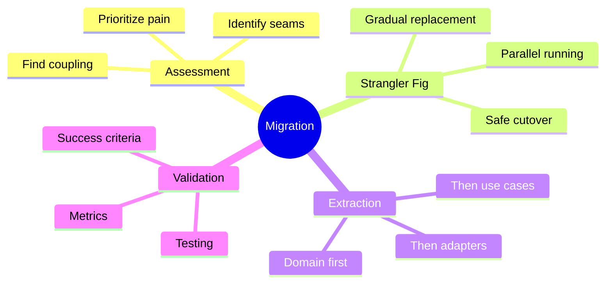

# Migration Strategies

How do you migrate an existing application to Hexagonal Architecture? This chapter covers practical strategies for gradual, low-risk migration.

## What You'll Learn in This Chapter

## Chapter Overview

### 9.1 Assessing Your Current Architecture
Learn to identify coupling, pain points, and the best places to start.

### 9.2 The Strangler Fig Pattern
Gradually replace parts of your system without a risky "big bang" rewrite.

### 9.3 Extracting the Domain
How to pull business logic out of handlers and into a clean domain layer.

### 9.4 Introducing Ports and Adapters
Create interfaces incrementally as you extract functionality.

### 9.5 Validating the Migration
Measure success and ensure you haven't broken anything.

## The Golden Rule of Migration

> **Never stop shipping.** A migration that blocks feature development is a migration that will be cancelled.

Migrate incrementally, proving value at each step.

Let's begin!
