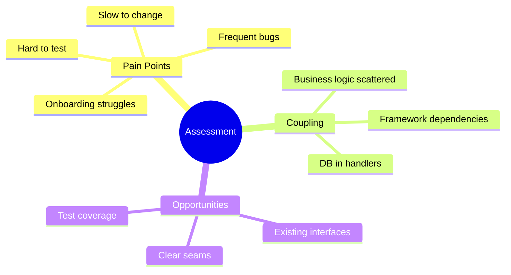
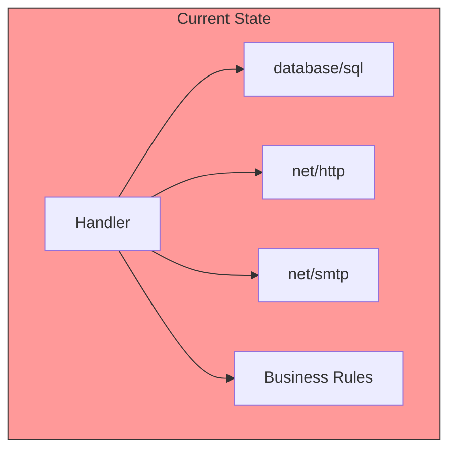
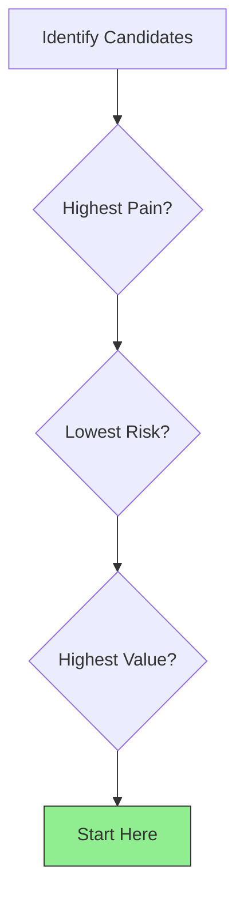

# Assessing Your Current Architecture

## Sam's Scenario

Remember Riley, Sam's friend who was building a simple supply tracking tool? It turned out not so simple. Six months later, Riley's codebase was a tangled mess of database calls in HTTP handlers, business logic scattered everywhere, and zero tests.

"I can't add features anymore without breaking something," Riley confessed to Sam. "Every change takes a week and introduces three bugs. Can you help me migrate to hexagonal architecture?"

Sam pulled up Riley's code. "First, we need to assess what you have. Let's map out your current architecture - where's the business logic, what's coupled to what, and what are your biggest pain points. Then we'll create a migration plan."

## Understanding Your Starting Point

Before migrating, you need to understand what you have. This assessment will guide your migration strategy.

## What to Look For



## Signs You Need Migration

| Symptom | Root Cause | Hex Arch Solution |
|---------|------------|-------------------|
| Tests need real DB | Domain coupled to infrastructure | Ports abstract infrastructure |
| Changes break unrelated code | No clear boundaries | Layer isolation |
| New features take too long | Spaghetti dependencies | Clear dependency direction |
| Hard to onboard developers | No consistent structure | Standard project layout |

## Assessing Your Codebase

### 1. Find the Business Logic

Where does your business logic live?

```go
// ❌ Common: Business logic in handlers
func CreateUserHandler(w http.ResponseWriter, r *http.Request) {
    // Parsing (adapter concern)
    var req CreateUserRequest
    json.NewDecoder(r.Body).Decode(&req)

    // Validation (domain concern - mixed in!)
    if len(req.Name) < 2 {
        http.Error(w, "name too short", 400)
        return
    }

    // Database (adapter concern - mixed in!)
    _, err := db.Exec("INSERT INTO users...")

    // Response (adapter concern)
    w.WriteHeader(201)
}
```

### 2. Identify Coupling



Questions to ask:
- Can you test business logic without a database?
- Can you change the database without modifying handlers?
- Can you add a CLI without duplicating logic?

### 3. Map Dependencies

Create a dependency diagram:

```go
// Example: Document what imports what
handlers/
    user_handler.go
        → imports: database/sql, net/http, models, utils

models/
    user.go
        → imports: database/sql (!)

utils/
    validation.go
        → imports: nothing (good!)
```

## Prioritizing Migration



### Migration Priority Matrix

| Area | Pain Level | Risk | Value | Priority |
|------|------------|------|-------|----------|
| User management | High | Low | High | **1st** |
| Payment processing | High | High | High | 2nd |
| Reporting | Low | Low | Low | Later |
| Legacy import | Medium | High | Low | Last |

## Create a Migration Map

Document your findings:

```markdown
## Migration Assessment: User Service

### Current State
- Business logic split between `handlers/user.go` and `models/user.go`
- Direct SQL queries in handlers
- No tests for business rules
- Validation mixed with HTTP handling

### Target State
- `domain/entities/user.go` - Entity with validation
- `domain/repositories/user.go` - Repository interface
- `application/usecases/user.go` - Use cases
- `adapters/http/user_handler.go` - HTTP adapter
- `adapters/db/postgres/user_repo.go` - DB adapter

### Migration Steps
1. Extract User entity with validation
2. Create repository interface
3. Move business logic to use case
4. Create adapters
5. Update handlers to use adapters
```

## Assessment Checklist

- [ ] Identified where business logic lives
- [ ] Mapped infrastructure dependencies
- [ ] Listed pain points and their causes
- [ ] Prioritized areas for migration
- [ ] Created target state diagram
- [ ] Defined success criteria

## Sam's Assessment of Riley's Code

After reviewing Riley's codebase, Sam created an assessment:

**Pain Points:**
- Adding new features takes 5-7 days (used to be 1 day)
- Every deploy breaks something
- Can't test without full database
- New developer onboarding takes 2+ months

**Architecture Issues:**
- Item validation mixed into HTTP handlers
- Direct SQL queries in controllers
- Business rules scattered across 12 files
- Database types leak into response models

**Migration Priority:**
1. Item management (highest pain, core feature)
2. User authentication (medium pain, isolated)
3. Reporting (low pain, separate module)

"We'll start with item management," Sam explained. "It's your core feature and causing the most pain. We'll use the strangler fig pattern to migrate it incrementally while you keep shipping features."
