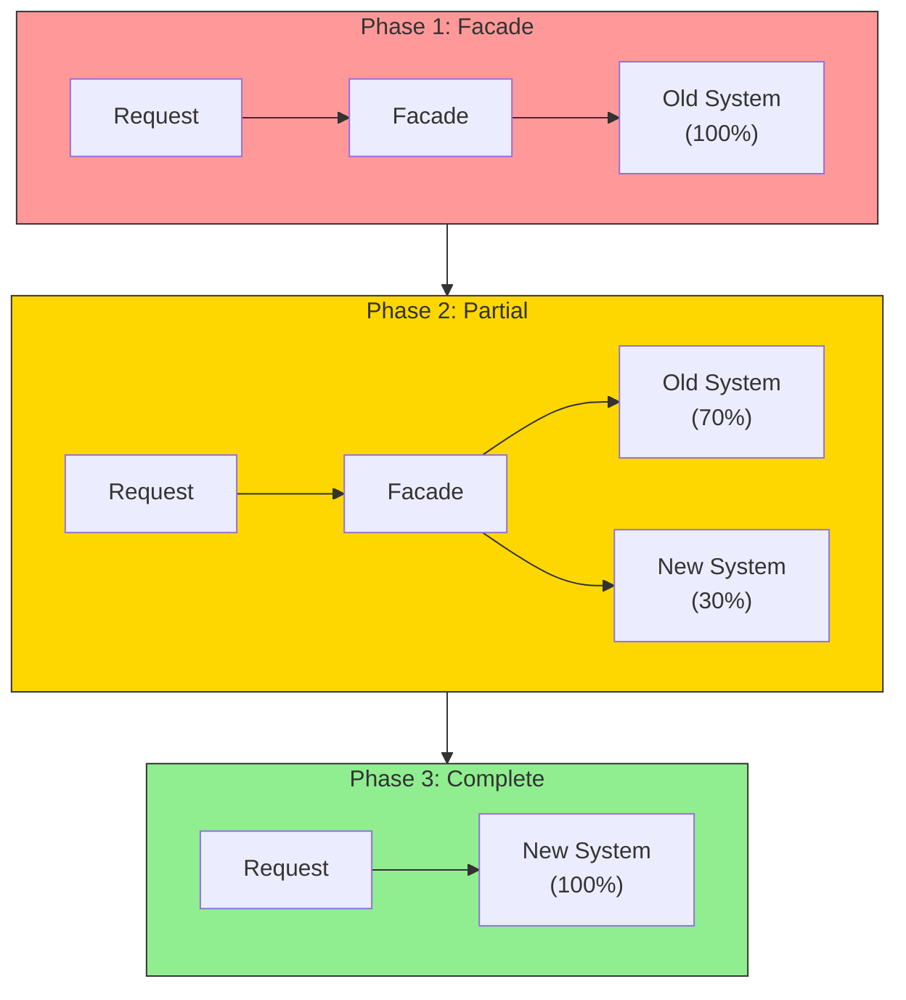
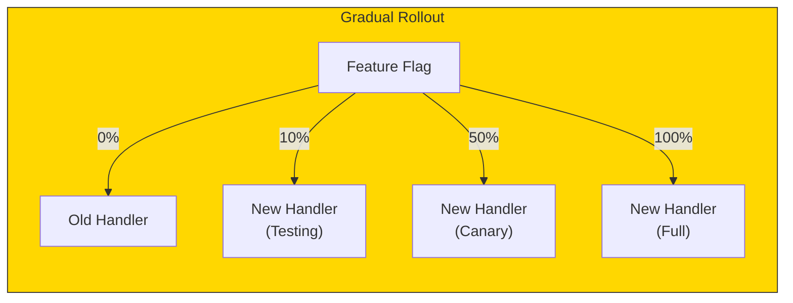
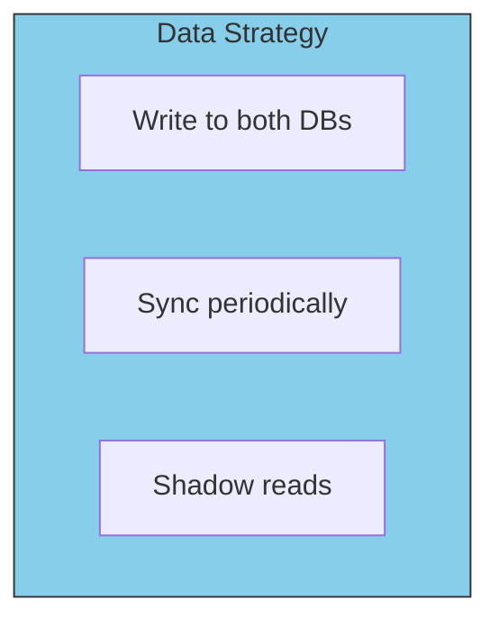

# The Strangler Fig Pattern

The Strangler Fig pattern, named after fig trees that gradually wrap and replace their hosts, allows you to migrate incrementally without risky big-bang rewrites.

## The Pattern



## How It Works

1. **Add a Facade**: Route all requests through a new facade/proxy
2. **Migrate Incrementally**: Move one endpoint/feature at a time to the new system
3. **Run in Parallel**: Old and new systems coexist during migration
4. **Cut Over**: Once all traffic goes to the new system, remove the old

## Implementation: Router as Facade

```go
// The facade routes to old or new handlers
type MigrationRouter struct {
    oldHandler *legacy.UserHandler
    newHandler *hexagonal.UserHandler
    featureFlags FeatureFlags
}

func (r *MigrationRouter) CreateUser(w http.ResponseWriter, req *http.Request) {
    if r.featureFlags.IsEnabled("hex_create_user") {
        r.newHandler.CreateUser(w, req)  // New hexagonal implementation
    } else {
        r.oldHandler.CreateUser(w, req)  // Legacy implementation
    }
}

func (r *MigrationRouter) GetUser(w http.ResponseWriter, req *http.Request) {
    // Still using old system
    r.oldHandler.GetUser(w, req)
}
```

## Feature Flag Strategy



```go
type FeatureFlags struct {
    store FeatureFlagStore
}

func (f *FeatureFlags) IsEnabled(flag string) bool {
    return f.store.GetPercentage(flag) > rand.Float64()*100
}

// Gradual rollout
// Day 1: SetPercentage("hex_create_user", 10)  // 10% traffic
// Day 3: SetPercentage("hex_create_user", 50)  // 50% traffic
// Day 7: SetPercentage("hex_create_user", 100) // Full migration
```

## Data Migration Considerations



When migrating data access:

```go
// Dual-write during migration
func (r *MigrationRepository) Save(ctx context.Context, user *User) error {
    // Write to old system
    if err := r.oldRepo.Save(ctx, user); err != nil {
        return err
    }

    // Also write to new system
    if err := r.newRepo.Save(ctx, user); err != nil {
        log.Error("new system write failed", "error", err)
        // Don't fail the request - old system is source of truth
    }

    return nil
}
```

## Rollback Safety

```go
func (r *MigrationRouter) CreateUser(w http.ResponseWriter, req *http.Request) {
    if r.featureFlags.IsEnabled("hex_create_user") {
        defer func() {
            if err := recover(); err != nil {
                // Automatic rollback on panic
                r.featureFlags.Disable("hex_create_user")
                log.Error("new handler panicked, rolling back", "error", err)
                r.oldHandler.CreateUser(w, req)
            }
        }()
        r.newHandler.CreateUser(w, req)
    } else {
        r.oldHandler.CreateUser(w, req)
    }
}
```

## Strangler Fig Checklist

| Step | Action | Success Criteria |
|------|--------|------------------|
| 1 | Add facade/router | All traffic through router |
| 2 | Create new handler | Tests pass |
| 3 | Enable for 10% | No errors |
| 4 | Enable for 50% | Latency similar |
| 5 | Enable for 100% | Metrics match |
| 6 | Remove old code | Clean codebase |

## Benefits of Strangler Fig

- **Low risk**: Rollback is instant
- **Continuous delivery**: Never stop shipping
- **Measurable progress**: Track percentage migrated
- **Team learning**: Learn patterns on low-risk features first
