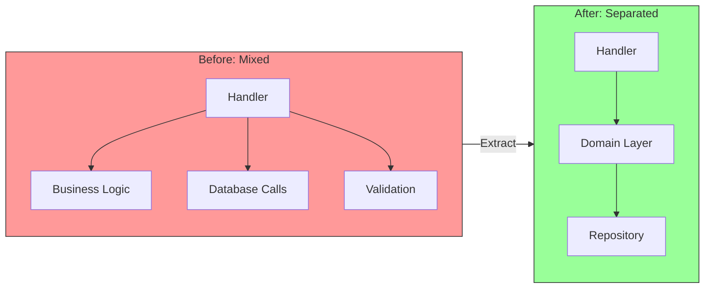

# Extracting the Domain

## Sam's Scenario

Riley's CreateItemHandler was a mess - 150 lines of mixed HTTP parsing, database queries, and business validation. Sam showed Riley how to extract the domain layer first.

"The hardest part of migration is identifying what's actually business logic versus infrastructure plumbing," Sam explained. "Let's look at your CreateItemHandler and separate the business rules from the HTTP and database concerns."

Together, they found the business rules buried in the handler: item names must be unique, quantities can't be negative, categories must exist, and reorder points trigger low-stock alerts.

"This business logic belongs in domain entities, not HTTP handlers," Sam said. "Let's extract it."

## The First Step

The first and most important step: pull business logic out of handlers and infrastructure into a clean domain layer.

## Before and After



## Step 1: Identify Business Rules

Look for code that:
- Validates business constraints (not just data format)
- Makes decisions based on business rules
- Calculates business values
- Changes state based on business events

```go
// Before: Handler with embedded business logic
func CreateUserHandler(w http.ResponseWriter, r *http.Request) {
    var req CreateUserRequest
    json.NewDecoder(r.Body).Decode(&req)

    // ← Business rule: name length
    if len(req.Name) < 2 {
        http.Error(w, "name too short", 400)
        return
    }

    // ← Business rule: email format
    if !strings.Contains(req.Email, "@") {
        http.Error(w, "invalid email", 400)
        return
    }

    // ← Business rule: unique email
    var exists bool
    db.QueryRow("SELECT EXISTS(SELECT 1 FROM users WHERE email = ?)", req.Email).Scan(&exists)
    if exists {
        http.Error(w, "email taken", 400)
        return
    }

    // Insert...
}
```

## Step 2: Create Domain Entity

Extract validation into the entity:

```go
// domain/entities/user.go
package entities

var (
    ErrNameTooShort  = errors.New("name must be at least 2 characters")
    ErrInvalidEmail  = errors.New("invalid email format")
    ErrEmailTaken    = errors.New("email is already taken")
)

type User struct {
    ID        string
    Name      string
    Email     string
    CreatedAt time.Time
}

// Factory function with validation
func NewUser(name, email string) (*User, error) {
    if len(name) < 2 {
        return nil, ErrNameTooShort
    }
    if !isValidEmail(email) {
        return nil, ErrInvalidEmail
    }

    return &User{
        ID:        uuid.New().String(),
        Name:      name,
        Email:     email,
        CreatedAt: time.Now(),
    }, nil
}

func isValidEmail(email string) bool {
    // Simple check - could use regex for more thorough validation
    return strings.Contains(email, "@") && strings.Contains(email, ".")
}
```

## Step 3: Create Repository Interface

Define what persistence operations you need:

```go
// domain/repositories/user_repository.go
package repositories

type UserRepository interface {
    Save(ctx context.Context, user *entities.User) error
    FindByID(ctx context.Context, id string) (*entities.User, error)
    FindByEmail(ctx context.Context, email string) (*entities.User, error)
    ExistsByEmail(ctx context.Context, email string) (bool, error)
}
```

## Step 4: Create Use Case

Move orchestration logic:

```go
// application/usecases/create_user.go
package usecases

type CreateUserInput struct {
    Name  string
    Email string
}

type CreateUserUseCase struct {
    userRepo repositories.UserRepository
}

func (uc *CreateUserUseCase) Execute(ctx context.Context, input CreateUserInput) (*entities.User, error) {
    // Check email uniqueness (business rule)
    exists, err := uc.userRepo.ExistsByEmail(ctx, input.Email)
    if err != nil {
        return nil, fmt.Errorf("failed to check email: %w", err)
    }
    if exists {
        return nil, entities.ErrEmailTaken
    }

    // Create entity (validates internally)
    user, err := entities.NewUser(input.Name, input.Email)
    if err != nil {
        return nil, err
    }

    // Persist
    if err := uc.userRepo.Save(ctx, user); err != nil {
        return nil, fmt.Errorf("failed to save user: %w", err)
    }

    return user, nil
}
```

## Step 5: Update Handler

Now the handler is thin:

```go
// adapters/http/user_handler.go
func (h *UserHandler) CreateUser(w http.ResponseWriter, r *http.Request) {
    var req CreateUserRequest
    if err := json.NewDecoder(r.Body).Decode(&req); err != nil {
        http.Error(w, "invalid json", 400)
        return
    }

    user, err := h.createUserUseCase.Execute(r.Context(), usecases.CreateUserInput{
        Name:  req.Name,
        Email: req.Email,
    })

    if err != nil {
        h.handleError(w, err)  // Translate domain errors to HTTP
        return
    }

    w.WriteHeader(http.StatusCreated)
    json.NewEncoder(w).Encode(toUserResponse(user))
}
```

## Extraction Checklist

- [ ] Identified business rules in handlers
- [ ] Created entity with factory function
- [ ] Moved validation to entity
- [ ] Created repository interface
- [ ] Created use case for orchestration
- [ ] Updated handler to be thin
- [ ] Added tests for domain logic

## Riley's Extraction Results

After extracting the Item domain entity, Riley was amazed. "The entity has 15 tests and they run in 2 milliseconds. Before, I couldn't test this logic at all because it was embedded in the HTTP handler with database calls."

The CreateItemHandler shrank from 150 lines to 20 lines - just HTTP parsing, calling the use case, and formatting the response.

"Now I can test business rules without a database, without HTTP mocking, without any infrastructure," Riley said. "The domain logic is finally isolated and testable. This is what you meant by 'the domain at the center.'"

Sam smiled. "Exactly. Now your business logic is portable. If you need a CLI tool later, you'll reuse the same entities and use cases with a different adapter."
