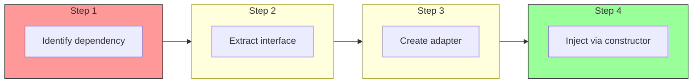

# Introducing Ports and Adapters

Once you've extracted the domain, you can introduce ports and adapters incrementally. This step creates the boundaries that make your architecture truly hexagonal.

## The Process



## Example: Extracting Database Dependency

### Before: Direct Database Usage

```go
// Old code: Handler directly uses database
func CreateUserHandler(w http.ResponseWriter, r *http.Request) {
    // ... validation ...

    _, err := db.Exec("INSERT INTO users (id, name, email) VALUES (?, ?, ?)",
        uuid.New(), req.Name, req.Email)
    if err != nil {
        http.Error(w, "database error", 500)
        return
    }
}
```

### Step 1: Create the Port (Interface)

```go
// domain/repositories/user_repository.go
package repositories

type UserRepository interface {
    Save(ctx context.Context, user *entities.User) error
    FindByID(ctx context.Context, id string) (*entities.User, error)
    FindByEmail(ctx context.Context, email string) (*entities.User, error)
}
```

### Step 2: Create the Adapter

```go
// adapters/db/sqlite/user_repository.go
package sqlite

type UserRepository struct {
    db *sql.DB
}

func NewUserRepository(db *sql.DB) *UserRepository {
    return &UserRepository{db: db}
}

func (r *UserRepository) Save(ctx context.Context, user *entities.User) error {
    query := `INSERT INTO users (id, name, email, created_at) VALUES (?, ?, ?, ?)`
    _, err := r.db.ExecContext(ctx, query, user.ID, user.Name, user.Email, user.CreatedAt)
    if err != nil {
        // Translate database errors to domain errors
        if isUniqueViolation(err) {
            return entities.ErrEmailTaken
        }
        return err
    }
    return nil
}

func (r *UserRepository) FindByID(ctx context.Context, id string) (*entities.User, error) {
    query := `SELECT id, name, email, created_at FROM users WHERE id = ?`
    row := r.db.QueryRowContext(ctx, query, id)

    var user entities.User
    err := row.Scan(&user.ID, &user.Name, &user.Email, &user.CreatedAt)
    if err == sql.ErrNoRows {
        return nil, entities.ErrUserNotFound
    }
    return &user, err
}
```

### Step 3: Inject via Constructor

```go
// application/usecases/user_usecase.go
type UserUseCase struct {
    userRepo repositories.UserRepository  // Depends on interface, not concrete
}

func NewUserUseCase(userRepo repositories.UserRepository) *UserUseCase {
    return &UserUseCase{userRepo: userRepo}
}
```

### Step 4: Wire in Main

```go
// cmd/api/main.go
func main() {
    db := setupDatabase()

    // Create adapter
    userRepo := sqlite.NewUserRepository(db)

    // Inject into use case
    userUseCase := usecases.NewUserUseCase(userRepo)

    // Create handler
    userHandler := http.NewUserHandler(userUseCase)
}
```

## Extracting External Service Dependencies

Apply the same pattern to any external dependency:

```go
// Port
type EmailSender interface {
    SendWelcomeEmail(ctx context.Context, to, name string) error
}

// Adapter: Real implementation
type SendGridEmailSender struct {
    client *sendgrid.Client
}

func (s *SendGridEmailSender) SendWelcomeEmail(ctx context.Context, to, name string) error {
    // SendGrid API calls
}

// Adapter: Console implementation for development
type ConsoleEmailSender struct {
    logger *slog.Logger
}

func (s *ConsoleEmailSender) SendWelcomeEmail(ctx context.Context, to, name string) error {
    s.logger.Info("would send welcome email", "to", to, "name", name)
    return nil
}
```

## Incremental Introduction

Migrate one dependency at a time:

```mermaid
gantt
    title Port/Adapter Migration
    dateFormat  X
    axisFormat %d

    section Week 1
    UserRepository    :done, 0, 5
    section Week 2
    EmailSender       :active, 5, 10
    section Week 3
    PaymentGateway    :15, 20
    section Week 4
    FileStorage       :20, 25
```



## Benefits You'll See Immediately

| After Extracting | Benefit |
|------------------|---------|
| UserRepository | Can test use cases with mock repo |
| EmailSender | Can develop without sending real emails |
| PaymentGateway | Can test payment flows with fake gateway |

## Verification

Ensure the adapter correctly implements the port:

```go
// Compile-time interface check
var _ repositories.UserRepository = (*sqlite.UserRepository)(nil)
var _ repositories.UserRepository = (*postgres.UserRepository)(nil)
var _ repositories.UserRepository = (*memory.UserRepository)(nil)
```
