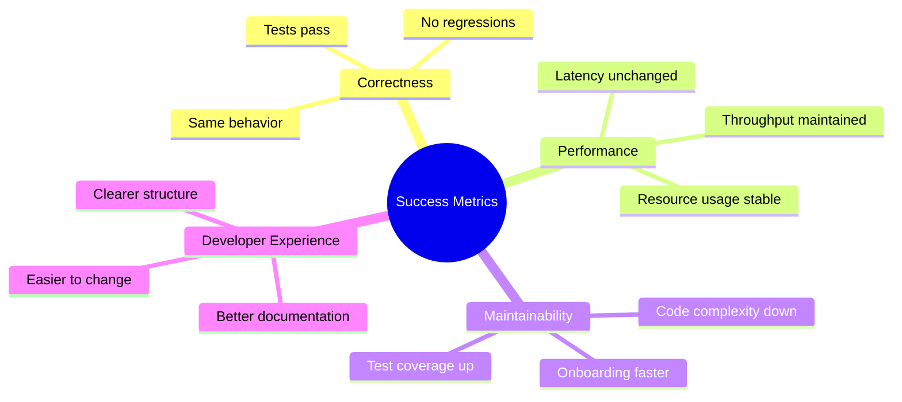
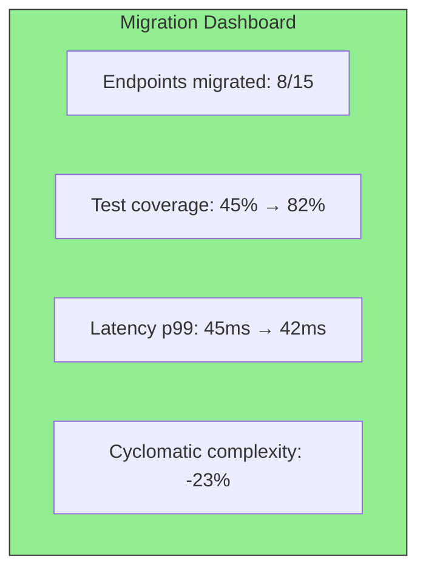
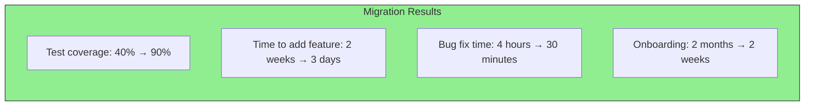

# Validating the Migration

How do you know the migration is successful? Define success criteria upfront and measure throughout.

## Success Metrics



## Testing Strategy

### 1. Characterization Tests (Before Migration)

Capture current behavior before you change anything:

```go
// Capture current behavior as tests
func TestCreateUser_CurrentBehavior(t *testing.T) {
    // Call old handler
    resp := httptest.NewRecorder()
    req := httptest.NewRequest("POST", "/users",
        strings.NewReader(`{"name":"John","email":"john@example.com"}`))

    oldHandler.CreateUser(resp, req)

    // Capture what we expect
    assert.Equal(t, 201, resp.Code)

    var user UserResponse
    json.NewDecoder(resp.Body).Decode(&user)
    assert.NotEmpty(t, user.ID)
    assert.Equal(t, "John", user.Name)
}
```

### 2. Domain Unit Tests (During Migration)

Add tests for extracted domain logic:

```go
func TestNewUser_Validation(t *testing.T) {
    tests := []struct {
        name    string
        input   string
        email   string
        wantErr error
    }{
        {"valid", "John", "john@example.com", nil},
        {"short name", "J", "john@example.com", entities.ErrNameTooShort},
        {"invalid email", "John", "invalid", entities.ErrInvalidEmail},
    }

    for _, tt := range tests {
        t.Run(tt.name, func(t *testing.T) {
            _, err := entities.NewUser(tt.input, tt.email)
            assert.ErrorIs(t, err, tt.wantErr)
        })
    }
}
```

### 3. Integration Tests (After Migration)

Verify the complete flow still works:

```go
func TestCreateUser_Integration(t *testing.T) {
    // Setup real database (test container)
    db := setupTestDB(t)
    userRepo := sqlite.NewUserRepository(db)
    emailSender := memory.NewEmailSender()
    useCase := usecases.NewUserUseCase(userRepo, emailSender)
    handler := http.NewUserHandler(useCase)

    // Test the flow
    resp := httptest.NewRecorder()
    req := httptest.NewRequest("POST", "/users",
        strings.NewReader(`{"name":"John","email":"john@example.com"}`))

    handler.CreateUser(resp, req)

    assert.Equal(t, 201, resp.Code)

    // Verify database state
    user, _ := userRepo.FindByEmail(context.Background(), "john@example.com")
    assert.Equal(t, "John", user.Name)
}
```

## Performance Comparison

```go
func BenchmarkCreateUser_Old(b *testing.B) {
    for i := 0; i < b.N; i++ {
        // Old implementation
        oldHandler.CreateUser(...)
    }
}

func BenchmarkCreateUser_New(b *testing.B) {
    for i := 0; i < b.N; i++ {
        // New implementation
        newHandler.CreateUser(...)
    }
}
```

Compare:
- Latency (should be similar or better)
- Memory allocations
- Database query count

## Migration Dashboard

Track progress with metrics:



## Validation Checklist

| Phase | Validation | Criteria |
|-------|------------|----------|
| **Before** | Characterization tests | All current behavior captured |
| **During** | Unit tests | Domain logic tested in isolation |
| **After** | Integration tests | Complete flows verified |
| **After** | Performance tests | No regression |
| **After** | Code metrics | Complexity reduced |

## Rollback Criteria

Define when to rollback:

```go
// Automatic rollback triggers
type RollbackCriteria struct {
    ErrorRateThreshold   float64 // > 1% errors
    LatencyP99Threshold  time.Duration // > 500ms
    FailedHealthChecks   int // > 3 consecutive
}

func ShouldRollback(metrics Metrics, criteria RollbackCriteria) bool {
    return metrics.ErrorRate > criteria.ErrorRateThreshold ||
           metrics.LatencyP99 > criteria.LatencyP99Threshold ||
           metrics.ConsecutiveFailures > criteria.FailedHealthChecks
}
```

## Celebrating Success

When migration is complete:

1. **Remove old code**: Delete the legacy implementation
2. **Update documentation**: Document the new architecture
3. **Share learnings**: Present to the team what worked
4. **Measure improvements**: Quantify the benefits


