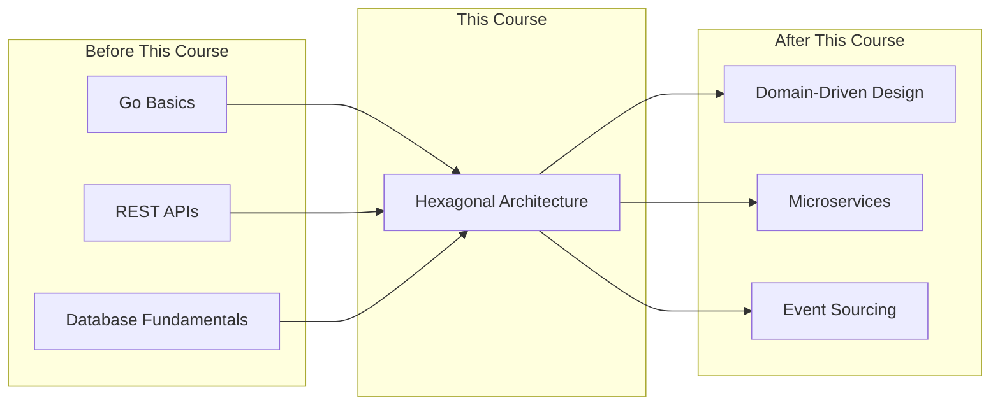

# Prerequisites

What you need to know before starting this course.

---

## Required Knowledge

You **must** be comfortable with these concepts to succeed in this course:

### 1. Go Programming Basics

You should be able to:
- [ ] Write functions and methods
- [ ] Define structs and interfaces
- [ ] Use pointers and understand when to use them
- [ ] Work with slices and maps
- [ ] Handle errors with `error` returns
- [ ] Organize code into packages

**Self-Assessment:** Can you write a simple REST API in Go without copying code?

If not, consider: [Go by Example](https://gobyexample.com/) or [A Tour of Go](https://tour.golang.org/)

### 2. Interfaces and Dependency Injection

You should understand:
- [ ] How interfaces define behavior contracts
- [ ] How a struct "implements" an interface
- [ ] Passing dependencies through constructors
- [ ] Why depending on interfaces enables flexibility

**Self-Assessment:** Given this code, what would you pass for `repository`?

```go
type UserService struct {
    repository UserRepository
}

type UserRepository interface {
    FindByID(id string) (*User, error)
}

func NewUserService(repo UserRepository) *UserService {
    return &UserService{repository: repo}
}
```

If this isn't immediately clear, review interface-based design.

### 3. REST APIs

You should be familiar with:
- [ ] HTTP methods (GET, POST, PUT, DELETE)
- [ ] Request/response patterns
- [ ] JSON serialization
- [ ] Basic routing concepts

**Self-Assessment:** Can you describe what a REST endpoint like `POST /users` does?

---

## Recommended Knowledge

These will help you get more from the course, but aren't strictly required:

### 1. Database Access

Experience with:
- [ ] SQL basics (SELECT, INSERT, UPDATE)
- [ ] Using `database/sql` or an ORM in Go
- [ ] Connection management

This helps you appreciate the repository adapter pattern in Chapter 3.

### 2. Unit Testing

Familiarity with:
- [ ] Writing tests with `testing` package
- [ ] Table-driven tests
- [ ] Test assertions
- [ ] Basic mocking concepts

This makes Chapter 7 (Testing) much easier to follow.

### 3. Software Design Principles

Awareness of:
- [ ] SOLID principles (especially Dependency Inversion)
- [ ] Separation of concerns
- [ ] High cohesion, low coupling

Don't worry if these are fuzzy—we'll reinforce them throughout the course.

---

## Development Environment

You'll need:

| Tool | Version | Purpose |
|------|---------|---------|
| Go | 1.21+ | Language runtime |
| Git | Any | Version control |
| Editor/IDE | Any | VS Code with Go extension recommended |
| Terminal | Any | Running commands |

Optional but helpful:
- Docker (for running databases locally)
- Make (for running build commands)
- PostgreSQL client (for database examples)

---

## Learning Path

### Where This Course Fits



### Before This Course

If you're not ready for this course, consider:

| Topic | Resource |
|-------|----------|
| Go basics | [Go by Example](https://gobyexample.com/) |
| Interfaces | [Effective Go - Interfaces](https://go.dev/doc/effective_go#interfaces) |
| REST APIs | [Build a REST API with Go](https://tutorialedge.net/golang/creating-restful-api-with-golang/) |
| Testing | [Testing in Go](https://go.dev/doc/tutorial/add-a-test) |

### After This Course

Once you've mastered Hexagonal Architecture, explore:

| Topic | Why |
|-------|-----|
| Domain-Driven Design (DDD) | Deeper domain modeling techniques |
| Microservices | Apply patterns at service boundaries |
| Event Sourcing/CQRS | Advanced patterns that pair with Hex |
| Clean Architecture | Alternative perspective on same principles |

---

## Quick Readiness Check

Answer these questions honestly:

1. **Can you write a Go function that accepts an interface parameter?**
   - Yes → Great, you're ready
   - No → Review interfaces first

2. **Do you understand why `http.Handler` is an interface in Go?**
   - Yes → You'll grasp adapters quickly
   - No → Review the standard library patterns

3. **Have you written code that was hard to test?**
   - Yes → Perfect, you'll appreciate the solutions
   - No → You might not see the point yet (that's okay!)

4. **Have you been frustrated by changing one thing and breaking another?**
   - Yes → This course is for you
   - No → Keep it in mind for when it happens

---

## Not Sure If You're Ready?

Start Chapter 1. The first sub-chapter presents a "before" picture of tangled code that should feel familiar. If it doesn't resonate, you might want more experience with real-world codebases before taking this course.

The concepts aren't advanced, but they solve problems you need to have *felt* to truly appreciate.

---

## Let's Begin

If you've checked off the required knowledge and have your development environment ready, you're prepared to follow Sam's journey transforming BookShelf with Hexagonal Architecture.

Head to **Chapter 1: Introduction to Hexagonal Architecture** to meet Sam and see the problem firsthand.
