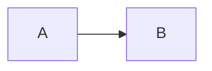
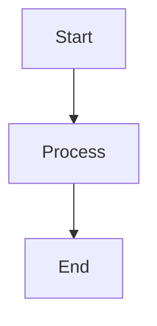
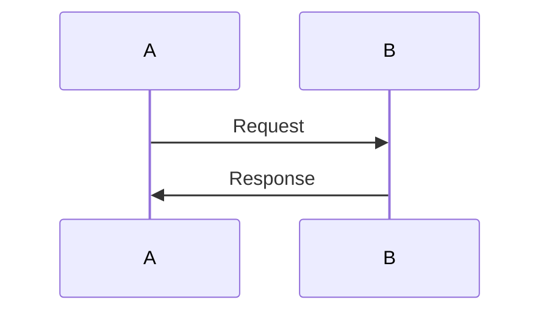

# Diagram Layout Components

This document describes the diagram layout system for positioning Mermaid diagrams alongside text content.

## Overview

The markdown renderer supports three layout modes for Mermaid diagrams:

1. **Normal** - Diagram displayed above/below text (default)
2. **Side-by-Side** - Diagram and text in columns
3. **Floating** - Diagram floats with text wrapping around it

## Markdown Syntax

### Normal Layout (Default)

Standard mermaid code block:

```markdown

```

### Side-by-Side Layout

```markdown
:::sidebyside:position:size


Your text content here...
:::
```

### Floating Layout

```markdown
:::floating:position:size


Your text content here. This text will wrap around the floating diagram.
More paragraphs will continue to flow around the diagram until a new
section (h2, h3, or hr) is encountered.
:::
```

## Parameters

### Position

- `left` - Diagram on the left side
- `right` - Diagram on the right side (default)

### Size

Proportional widths:
- `1/3` - One-third width
- `1/2` - Half width (default)
- `2/3` - Two-thirds width
- `full` - Full width

Legacy sizes (still supported):
- `small` - Maps to `1/3`
- `medium` - Maps to `1/2`
- `large` - Maps to `2/3`

## Examples

### Floating diagram on the right, half width

```markdown
:::floating:right:1/2


This text appears beside the diagram and wraps underneath when it runs out of horizontal space.
:::
```

### Side-by-side with diagram on left, one-third width

```markdown
:::sidebyside:left:1/3


Explanation text in the right column, taking up two-thirds of the width.
:::
```

## Edit Mode

When edit mode is enabled in the course viewer, diagrams display a layout picker overlay with:

- **Layout buttons** - Switch between normal, side-by-side, and floating
- **Position controls** - Toggle left/right placement
- **Width controls** - Select 1/3, 1/2, 2/3, or full width
- **Move controls** - Reposition diagram relative to text paragraphs
- **Copy button** - Copy the generated markdown syntax

## Technical Details

### SVG Optimization

Mermaid diagrams are automatically optimized:
- The SVG viewBox is trimmed to fit the actual content bounds
- Excess padding is removed
- Diagrams scale to fill their allocated width

### Text Flow

For floating layouts:
- Text flows beside and underneath the diagram
- New sections (h2, h3, hr) clear the float and start fresh
- The `clear: both` CSS rule ensures clean section breaks

### Components

- `DiagramLayoutPicker` - UI controls for editing diagram layout
- `FloatingBlock` - Renders floating diagram with text
- `SideBySideBlock` - Renders side-by-side layout
- `MermaidDiagram` - Core diagram renderer with SVG optimization
