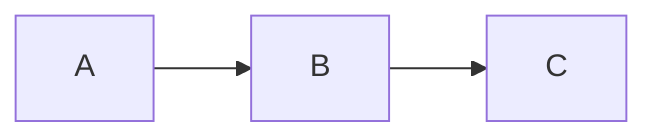
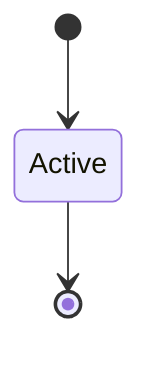

# Playbook Content Components

This document describes all available content block components for use in course markdown files.

## Quick Reference

| Component | Markdown Syntax | Purpose |
|-----------|----------------|---------|
| Terminal | ` ```terminal ` | Shell commands and output |
| Callout | ` ```info `, ` ```warning `, ` ```tip `, ` ```danger ` | Highlighted information boxes |
| CheckList | ` ```checklist ` | Success/key takeaway lists |
| MistakeList | ` ```mistakes ` | Common mistakes/errors |
| PagerAlert | ` ```pager ` | Notification/alert graphics |
| EmailPreview | ` ```email ` | Styled email message previews |
| ImageBlock | `` in layouts | Images with expand/caption support |
| SideBySide | `:::sidebyside` | Content with text columns |
| Floating | `:::floating` | Content with text wrapping |

---

## Content Blocks

### Terminal Block

Displays shell commands with syntax highlighting and a terminal-style header.

**Syntax:**
~~~markdown
```terminal
$ aws sqs create-queue --queue-name my-queue
{
    "QueueUrl": "https://sqs.us-east-1.amazonaws.com/123456789012/my-queue"
}
```
~~~

**Features:**
- `$` or `>` prefixed lines shown as commands (green prompt)
- `#` prefixed lines shown as comments (gray, italic)
- Other lines shown as output
- Supports multi-line commands with `\` continuation

---

### Callout

Highlighted information boxes with icons. Four variants available.

**Syntax:**
~~~markdown
```info
This is informational content that helps explain a concept.
```

```warning
Be careful! This warns about potential issues.
```

```tip
Pro tip: Here's a helpful suggestion.
```

```danger
Critical! This highlights important warnings or gotchas.
```
~~~

**Aliases:**
- `info` / `note`
- `warning` / `caution`
- `tip` / `hint`
- `danger` / `critical`

---

### CheckList

Success-themed list for key takeaways or completed items.

**Syntax:**
~~~markdown
```checklist
Messages are durably stored across multiple availability zones
Visibility timeout prevents duplicate processing
Dead Letter Queues catch poison messages
```
~~~

**Features:**
- Each line becomes a check item with green checkmark
- Prefix characters (`✓`, `✔`, `√`, `-`, `*`) are automatically stripped

---

### MistakeList

Error-themed list for common mistakes or things to avoid.

**Syntax:**
~~~markdown
```mistakes
Setting visibility timeout too short
Deleting messages before processing completes
Not handling partial batch failures
```
~~~

**Features:**
- Each line becomes an error item with red X
- Prefix characters (`✗`, `×`, `x`, `-`, `*`) are automatically stripped

---

### PagerAlert

Notification-style alert that looks like a phone/pager notification.

**Basic Syntax:**
~~~markdown
```pager
CRITICAL: Database connection failed
Unable to connect to primary database. Failover initiated.
```
~~~

**With Options:**
~~~markdown
```pager
@critical | 2:47 AM | PagerDuty
CRITICAL: Duplicate notifications detected
847 users received the same vaccination reminder twice.
```
~~~

**Options format:** `@variant | time | source`
- **variant**: `critical` (red), `warning` (amber), `info` (blue), `success` (green)
- **time**: Optional timestamp
- **source**: Optional source name (defaults to "ALERT")

**Features:**
- First content line becomes the title
- Remaining lines become the body
- Pulsing indicator for critical/warning variants

---

### EmailPreview

Styled email message preview that looks like an email client display.

**Basic Syntax:**
~~~markdown
```email
From: user@example.com
To: support@company.com
Subject: Account Question
---
Hello, I have a question about my account settings.
Could you help me understand how to change my password?
```
~~~

**With Variant:**
~~~markdown
```email
@warning
From: alerts@pettracker.com
To: user@example.com
Subject: Vaccination Reminder
Date: March 23, 2024
---
Your pet's vaccination appointment is coming up.
Please schedule an appointment within the next week.
```
~~~

**Options format:** First line `@variant` (optional)
- **variant**: `critical` (red), `warning` (amber), `info` (blue/gray), `success` (green)

**Email Headers:**
- `From:` - Sender email address
- `To:` - Recipient email address
- `Subject:` - Email subject line
- `Date:` - Optional timestamp
- `---` - Separator between headers and body

**Features:**
- Colored header bar based on variant (URGENT, IMPORTANT, EMAIL, etc.)
- Structured From/To/Subject display
- Body content with variant-appropriate text colors
- Hand-drawn aesthetic matching other components

---

### ImageBlock

Images with expand-on-click, loading states, and optional captions. Best used inside layouts.

**Standalone (regular markdown):**
~~~markdown

~~~

**With Caption (in layout):**
~~~markdown
:::floating:right:1/2


The Step Functions console provides a visual representation of your workflow,
making it easy to understand the flow of execution at a glance.
:::
~~~

**Features:**
- Click to expand image in modal overlay
- Loading skeleton while image loads
- Error state with fallback UI
- Optional caption displayed below image
- Rounded corners and shadow styling
- Works in both floating and sidebyside layouts

---

## Layout Components

Layouts wrap any content type (mermaid diagrams, emails, pager alerts, etc.) with text flowing around or beside them.

### SideBySide Layout

Places content alongside text in a two-column layout. The content stays sticky while scrolling.

**Syntax with Mermaid:**
~~~markdown
:::sidebyside:right:1/2


Your explanatory text goes here. It will appear in a column
next to the diagram. You can write multiple paragraphs.

The content will stick to the top as you scroll through
longer text content.
:::
~~~

**Syntax with Email:**
~~~markdown
:::sidebyside:left:1/3
```email
@warning
From: alerts@company.com
Subject: System Alert
---
Important notification message.
```

Text explaining the context of this email notification
appears here in the adjacent column.
:::
~~~

**Options:**
- **Position**: `left` or `right` (default: `right`) - which side the content appears
- **Size**: `1/3`, `1/2`, `2/3`, or `full` (default: `1/2`) - content column width

**Examples:**
```
:::sidebyside              → content right, 1/2 width
:::sidebyside:left         → content left, 1/2 width
:::sidebyside:right:2/3    → content right, 2/3 width
:::sidebyside:left:1/3     → content left, 1/3 width
```

---

### Floating Layout

Places content with text wrapping around it, like a floated image in a magazine.

**Syntax with Mermaid:**
~~~markdown
:::floating:right:1/2


Your text will wrap around the content naturally. This is great
for shorter content where you want the text to flow around it
rather than being in a strict column layout.

Continue writing and the text flows beneath the content once
it runs out of space beside it.
:::
~~~

**Syntax with Email:**
~~~markdown
:::floating:right:1/2
```email
@critical
From: ceo@company.com
Subject: URGENT: Action Required
Date: March 23, 2024 3:47 PM
---
The board is asking questions about today's outage.
We need a fix by end of week.
```

The email from leadership made it clear: the current
architecture couldn't handle growth. Something fundamental
had to change.
:::
~~~

**Options:**
- **Float**: `left` or `right` (default: `right`) - which side the content floats to
- **Size**: `1/3`, `1/2`, `2/3`, or `full` (default: `1/2`) - content width

### Supported Content Types in Layouts

Any of these content blocks can be placed inside a layout:
- `mermaid` - Diagrams (with edit mode support)
- `email` - Email previews
- `pager` - Pager alerts
- `terminal` - Terminal blocks
- `` - Images with expand/caption support

---

## Standard Markdown

All standard markdown features are supported:

- **Headers**: `#`, `##`, `###`, etc.
- **Bold/Italic**: `**bold**`, `*italic*`
- **Links**: `[text](url)`
- **Images**: `` - with expand button on hover
- **Lists**: `-` or `1.`
- **Tables**: Standard GFM tables
- **Code**: Inline `` `code` `` and fenced blocks with syntax highlighting
- **Mermaid**: ` ```mermaid ` diagrams (with expand button)

---

## Best Practices

1. **Use callouts sparingly** - Too many colored boxes becomes noisy
2. **Keep terminal blocks focused** - Show relevant commands, not entire sessions
3. **Match layout to content** - Use sidebyside for reference diagrams, floating for illustrative ones
4. **Test diagram sizes** - Some mermaid diagrams need `large` to be readable
5. **First line matters for PagerAlert** - It becomes the title, keep it short

---

## Adding New Components

To add a new content block:

1. Create component in `playbook/src/content-blocks/`
2. Export from `playbook/src/content-blocks/index.ts`
3. Add markdown syntax handling in `frontend/src/components/MarkdownRenderer.tsx`
4. Create Storybook story in `playbook/stories/`
5. Document in this file

Component naming convention:
- PascalCase for component names
- lowercase for markdown syntax triggers
