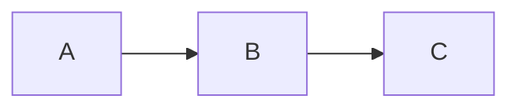
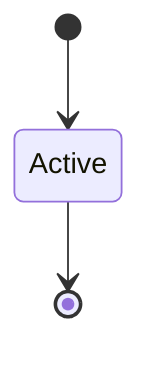

# Playbook Content Components

This document describes all available content block components for use in course markdown files.

## Quick Reference

| Component | Markdown Syntax | Purpose |
|-----------|----------------|---------|
| Terminal | ` ```terminal ` | Shell commands and output |
| Callout | ` ```info `, ` ```warning `, ` ```tip `, ` ```danger ` | Highlighted information boxes |
| CheckList | ` ```checklist ` | Success/key takeaway lists |
| MistakeList | ` ```mistakes ` | Common mistakes/errors |
| PagerAlert | ` ```pager ` | Notification/alert graphics |
| SideBySide | `:::sidebyside` | Diagram with text columns |
| Floating | `:::floating` | Diagram with text wrapping |

---

## Content Blocks

### Terminal Block

Displays shell commands with syntax highlighting and a terminal-style header.

**Syntax:**
~~~markdown
```terminal
$ aws sqs create-queue --queue-name my-queue
{
    "QueueUrl": "https://sqs.us-east-1.amazonaws.com/123456789012/my-queue"
}
```
~~~

**Features:**
- `$` or `>` prefixed lines shown as commands (green prompt)
- `#` prefixed lines shown as comments (gray, italic)
- Other lines shown as output
- Supports multi-line commands with `\` continuation

---

### Callout

Highlighted information boxes with icons. Four variants available.

**Syntax:**
~~~markdown
```info
This is informational content that helps explain a concept.
```

```warning
Be careful! This warns about potential issues.
```

```tip
Pro tip: Here's a helpful suggestion.
```

```danger
Critical! This highlights important warnings or gotchas.
```
~~~

**Aliases:**
- `info` / `note`
- `warning` / `caution`
- `tip` / `hint`
- `danger` / `critical`

---

### CheckList

Success-themed list for key takeaways or completed items.

**Syntax:**
~~~markdown
```checklist
Messages are durably stored across multiple availability zones
Visibility timeout prevents duplicate processing
Dead Letter Queues catch poison messages
```
~~~

**Features:**
- Each line becomes a check item with green checkmark
- Prefix characters (`✓`, `✔`, `√`, `-`, `*`) are automatically stripped

---

### MistakeList

Error-themed list for common mistakes or things to avoid.

**Syntax:**
~~~markdown
```mistakes
Setting visibility timeout too short
Deleting messages before processing completes
Not handling partial batch failures
```
~~~

**Features:**
- Each line becomes an error item with red X
- Prefix characters (`✗`, `×`, `x`, `-`, `*`) are automatically stripped

---

### PagerAlert

Notification-style alert that looks like a phone/pager notification.

**Basic Syntax:**
~~~markdown
```pager
CRITICAL: Database connection failed
Unable to connect to primary database. Failover initiated.
```
~~~

**With Options:**
~~~markdown
```pager
@critical | 2:47 AM | PagerDuty
CRITICAL: Duplicate notifications detected
847 users received the same vaccination reminder twice.
```
~~~

**Options format:** `@variant | time | source`
- **variant**: `critical` (red), `warning` (amber), `info` (blue), `success` (green)
- **time**: Optional timestamp
- **source**: Optional source name (defaults to "ALERT")

**Features:**
- First content line becomes the title
- Remaining lines become the body
- Pulsing indicator for critical/warning variants

---

## Layout Components

### SideBySide Layout

Places a diagram alongside text in a two-column layout. The diagram stays sticky while scrolling.

**Syntax:**
~~~markdown
:::sidebyside:right:medium


Your explanatory text goes here. It will appear in a column
next to the diagram. You can write multiple paragraphs.

The diagram will stick to the top as you scroll through
longer text content.
:::
~~~

**Options:**
- **Position**: `left` or `right` (default: `right`) - which side the diagram appears
- **Size**: `small`, `medium`, or `large` (default: `medium`) - diagram column width
  - `small`: 1/3 width
  - `medium`: 5/12 width
  - `large`: 1/2 width

**Examples:**
```
:::sidebyside              → diagram right, medium size
:::sidebyside:left         → diagram left, medium size
:::sidebyside:right:large  → diagram right, large size
:::sidebyside:left:small   → diagram left, small size
```

---

### Floating Layout

Places a diagram with text wrapping around it, like a floated image in a magazine.

**Syntax:**
~~~markdown
:::floating:right:medium


Your text will wrap around the diagram naturally. This is great
for shorter diagrams where you want the text to flow around them
rather than being in a strict column layout.

Continue writing and the text flows beneath the diagram once
it runs out of space beside it.
:::
~~~

**Options:**
- **Float**: `left` or `right` (default: `right`) - which side the diagram floats to
- **Size**: `small`, `medium`, or `large` (default: `medium`) - diagram width
  - `small`: 14rem (224px)
  - `medium`: 18rem (288px)
  - `large`: 24rem (384px)

---

## Standard Markdown

All standard markdown features are supported:

- **Headers**: `#`, `##`, `###`, etc.
- **Bold/Italic**: `**bold**`, `*italic*`
- **Links**: `[text](url)`
- **Images**: `` - with expand button on hover
- **Lists**: `-` or `1.`
- **Tables**: Standard GFM tables
- **Code**: Inline `` `code` `` and fenced blocks with syntax highlighting
- **Mermaid**: ` ```mermaid ` diagrams (with expand button)

---

## Best Practices

1. **Use callouts sparingly** - Too many colored boxes becomes noisy
2. **Keep terminal blocks focused** - Show relevant commands, not entire sessions
3. **Match layout to content** - Use sidebyside for reference diagrams, floating for illustrative ones
4. **Test diagram sizes** - Some mermaid diagrams need `large` to be readable
5. **First line matters for PagerAlert** - It becomes the title, keep it short

---

## Adding New Components

To add a new content block:

1. Create component in `playbook/src/content-blocks/`
2. Export from `playbook/src/content-blocks/index.ts`
3. Add markdown syntax handling in `frontend/src/components/MarkdownRenderer.tsx`
4. Create Storybook story in `playbook/stories/`
5. Document in this file

Component naming convention:
- PascalCase for component names
- lowercase for markdown syntax triggers
